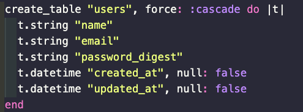
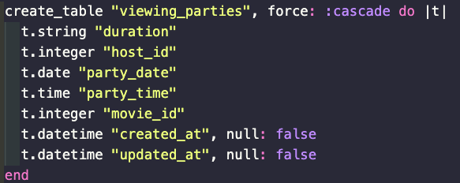
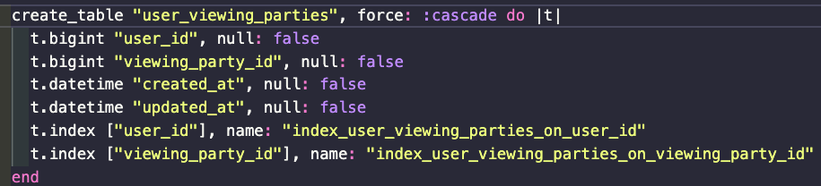

<!-- Improved compatibility of back to top link: See: https://github.com/othneildrew/Best-README-Template/pull/73 -->
<div id="top"></div>

<!--
*** Thanks for checking out the Best-README-Template. If you have a suggestion
*** that would make this better, please fork the repo and create a pull request
*** or simply open an issue with the tag "enhancement".
*** Don't forget to give the project a star!
*** Thanks again! Now go create something AMAZING! :D
-->


<!-- PROJECT SHIELDS -->
<!--
*** I'm using markdown "reference style" links for readability.
*** Reference links are enclosed in brackets [ ] instead of parentheses ( ).
*** See the bottom of this document for the declaration of the reference variables
*** for contributors-url, forks-url, etc. This is an optional, concise syntax you may use.
*** https://www.markdownguide.org/basic-syntax/#reference-style-links
-->
<p align="center">
  
  
  
  
</p>


<!-- PROJECT LOGO -->
<br />
<div align="center">
  <a href="https://github.com/brad-dunlap/viewing_party_lite">
    
  </a>

<h3 align="center"><a href="https://watch-together.herokuapp.com/">Viewing Party</a></h3>

  <p align="center">
    Mod 3 Paired Project
    <br />
  <p align="center">
    <a href="https://watch-together.herokuapp.com/">Live Application Link</a>
    <br />
       ·
    <a href="https://github.com/brad-dunlap/viewing_party_lite/issues">Report Bug</a>
    ·
    <a href="https://github.com/brad-dunlap/viewing_party_lite/issues">Request Feature</a>
  </p>
</div>
<br />


<!-- TABLE OF CONTENTS -->
<details>
  <summary>Table of Contents</summary>
  <ol>
    <li>
      <a href="#about-the-project">About The Project</a>
      <ul>
        <li><a href="#built-with">Built With</a></li>
      </ul>
    </li>
    <li>
      <a href="#getting-started">Getting Started</a>
      <ul>
        <li><a href="#prerequisites">Prerequisites</a></li>
        <li><a href="#installation">Installation</a></li>
      </ul>
    </li>
    <li><a href="#database-tables">Database Tables</a></li>
    <li><a href="#requests-and-responses">Requests and Responses</a></li>
    <li><a href="#contributing">Contributing</a></li>
    <li><a href="#contact">Contact</a></li>
    <li><a href="#acknowledgments">Acknowledgments</a></li>
  </ol>
</details>

<br />

<!-- ABOUT THE PROJECT -->
## About The Project


Viewing Party is a movie night planning application that will allow users to select a movie from an online database, set up a date and time for a viewing party, and invite their friends. 

The learning goals of this project are as follows:
#### Explicit
- Consume JSON APIs that require authentication ⭐ ⭐ ⭐
- Test consumption of APIs (facade,service,poros) ⭐ ⭐ ⭐
- Organize and refactor code to be more maintainable ⭐ ⭐
- Apply RuboCop’s style guide for code quality

#### Implicit
- Reading Documentation
- Implementing concepts that are not explicitly taught
- Practice individual research (articles, videos, mentors)
- Team communication
- Prioritizing goals/user stories
- Time management


This project uses the following technology stack:

- Ruby 3.1.1
- Rails 7.0.4
- PostgreSQL as the database for Active Record
- Puma web server
- bcrypt for password security
- Faraday for making HTTP requests
- Bootsnap for caching to reduce boot times
- Figaro for managing application configuration
- JSON API Serializer for generating JSON responses
- Styling done in hand rolled CSS

Additionally, the project uses several gems for development and testing, such as Capybara, RSpec, Faker, and Shoulda Matchers.

<a href="#top">Back to top</a>
<br />
<br />

### Built With

#### Versions:

[![Ruby]][Ruby-url] **3.1.1** <br>
[![Rails]][Rails-url] **7.0.4**<br>
[![Postgresql]][Postgresql-url] **1.1**

#### Testing:

[![Capybara]][Capybara-url]
[![Faker]][Faker-url]
[![Factory Bot]][Factory Bot-url]
[![RSpec]][RSpec-url]
[![Shoulda-Matchers]][Shoulda-Matchers-url]
[![SimpleCov]][SimpleCov-url]
[![VCR]][VCR-url]
[![Web-mock]][Web-mock-url]

#### Development Tools:

[![Heroku]][Heroku-url]
[![Faraday]][Faraday-url]
[![Figaro]][Figaro-url]
[![RuboCop]][RuboCop-url]

<a href="#top">Back to top</a>

<br />
<br />

<!-- GETTING STARTED -->
## Getting Started

To get a local copy up and running follow these simple example steps.

### Prerequisites

This is an example of how to list things you need to use the software and how to install them.
You must have the following software installed on your system:

* [Ruby](https://www.ruby-lang.org/en/downloads/)
* [Bundler](https://bundler.io/)
* [PostgreSQL](https://www.postgresql.org/download/)

<br />

### Installation

1. Clone the repo
   ```sh
   git clone git@github.com:brad-dunlap/viewing_party_lite.git
   ```
2. Install dependencies
   ```sh
   bundle install
   ```
3. Configure the database by running rails db:setup:
   ```js
   rails db:setup
   ```
4. Start the server by running rails server:
   ```js
   rails server
   ```
5. Visit http://localhost:3000 in your web browser to confirm that the app is running or use an application such as Postman to make your API calls to check the appropriate responses. 

<a href="#top">Back to top</a>
<br />
<br />
### Database Tables
<br />
Users:



Viewing Parties:



Users Viewing Parties:




See the [open issues](https://github.com/wise-app-team/wise-app-be/issues) for a full list of proposed features (and known issues).

<a href="#top">Back to top</a>
<br />
<br />
### Requests and Responses
<br />


<!-- CONTRIBUTING -->
## Contributing

Contributions are what make the open source community such an amazing place to learn, inspire, and create. Any contributions you make are **greatly appreciated**.

If you have a suggestion that would make this better, please fork the repo and create a pull request. You can also simply open an issue with the tag "enhancement".
Don't forget to give the project a star! Thanks again!

1. Fork the Project
2. Create your Feature Branch (`git checkout -b feature/AmazingFeature`)
3. Commit your Changes (`git commit -m 'Add some AmazingFeature'`)
4. Push to the Branch (`git push origin feature/AmazingFeature`)
5. Open a Pull Request

<a href="#top">Back to top</a>
<br />
<br />

<!-- CONTACT -->
## Contact


<div align="center">
  
  <p align="center">
    Bradley Dunlap<br>
    <a href="https://github.com/brad-dunlap">Github: brad-dunlap</a>
  </p>
</div>


<a href="#top">Back to top</a>
<br />
<br />
<!-- PROJECT MANAGER -->
## Project Manager

* Abdul Redd

<a href="#top">Back to top</a>
<br />
<br />
<!-- ACKNOWLEDGMENTS -->
## Acknowledgments

* ["The Best README Template" by Github User othneil](https://github.com/othneildrew/Best-README-Template)


<a href="#top">Back to top</a>


<!-- MARKDOWN LINKS & IMAGES -->
[contributors-shield]: https://img.shields.io/github/contributors/Medical-Information-Assistant-MIA/MIA-BE.svg?style=for-the-badge

[contributors-url]: https://github.com/Medical-Information-Assistant-MIA/MIA-BE/graphs/contributors

[forks-shield]: https://img.shields.io/github/forks/pantry-wizard/pantry_wizard_be.svg?style=for-the-badge

[forks-url]: https://github.com/pantry-wizard/pantry_wizard_be/network/members

[stars-shield]: https://img.shields.io/github/stars/pantry-wizard/pantry_wizard_be.svg?style=for-the-badge

[stars-url]: https://github.com/pantry-wizard/pantry_wizard_be/stargazers

[issues-shield]: https://img.shields.io/github/issues/pantry-wizard/pantry_wizard_be.svg?style=for-the-badge

[issues-url]: https://github.com/pantry-wizard/pantry_wizard_be/issues

[license-shield]: https://img.shields.io/github/license/pantry-wizard/pantry_wizard_be.svg?style=for-the-badge

[license-url]: https://github.com/pantry-wizard/pantry_wizard_be/blob/master/LICENSE.txt

[linkedin-shield]: https://img.shields.io/badge/-LinkedIn-black.svg?style=for-the-badge&logo=linkedin&colorB=555

[linkedin-url]: https://linkedin.com/in/linkedin_username

[product-screenshot]: images/screenshot.png

[Ruby]: https://img.shields.io/badge/ruby-000000?style=for-the-badge&logo=ruby&logoColor=red
[Ruby-url]: https://www.ruby-lang.org/en/

[Rails]: https://img.shields.io/badge/rails-red?style=for-the-badge&logo=rubyonrails&logoColor=white&color=red

[Rails-url]: https://rubyonrails.org/

[Postgresql]: https://img.shields.io/badge/postgresql-3386FF?style=for-the-badge&logo=postgresql&logoColor=FFFFFF
[Postgresql-url]: https://www.postgresql.org/

[Heroku]: https://img.shields.io/badge/Heroku-430098?style=for-the-badge&logo=heroku&logoColor=white
[Heroku-url]: https://www.heroku.com/

[Circle-CI]: https://img.shields.io/circleci/build/github/wise-app-team/wise-app-be/main
[Circle-url]: https://app.circleci.com/


[Puma]: https://img.shields.io/badge/-Puma-FFD43B?logo=puma&logoColor=black&style=for-the-badge
[Puma-url]: https://github.com/puma/puma

[bcrypt]: https://img.shields.io/badge/-bcrypt-00599C?logo=gnu-privacy-guard&logoColor=white&style=for-the-badge
[bcrypt-url]: https://github.com/codahale/bcrypt-ruby

[Faraday]: https://img.shields.io/badge/-Faraday-3E3E3E?logo=ruby&logoColor=white&style=for-the-badge
[Faraday-url]: https://github.com/lostisland/faraday

[Figaro]: https://img.shields.io/badge/-Figaro-FF4136?logo=rubygems&logoColor=white&style=for-the-badge
[Figaro-url]: https://github.com/laserlemon/figaro

[GraphQL]: https://img.shields.io/badge/-GraphQL-E10098?logo=graphql&logoColor=white&style=for-the-badge
[GraphQL-url]: https://graphql.org/

[GraphiQL]: https://img.shields.io/badge/-GraphiQL-E10098?logo=graphql&logoColor=white&style=for-the-badge
[GraphiQL-url]: https://github.com/graphql/graphiql


[JSON-Serializer]: https://img.shields.io/badge/-JSON%20API%20Serializer-1E90FF?logo=json&logoColor=white&style=for-the-badge
[JSON-Serializer-url]: https://github.com/jsonapi-serializer/jsonapi-serializer

[Capybara]: https://img.shields.io/badge/-Capybara-FF7F50?logo=rubygems&logoColor=white&style=for-the-badge
[Capybara-url]: https://github.com/teamcapybara/capybara

[RSpec]: https://img.shields.io/badge/-RSpec-FF7F50?logo=rubygems&logoColor=white&style=for-the-badge
[RSpec-url]: https://github.com/rspec/rspec

[Faker]: https://img.shields.io/badge/-Faker-FF69B4?logo=rubygems&logoColor=white&style=for-the-badge
[Faker-url]: https://github.com/faker-ruby/faker

[Shoulda-Matchers]: https://img.shields.io/badge/-Shoulda%20Matchers-5B5B5B?logo=rubygems&logoColor=white&style=for-the-badge
[Shoulda-Matchers-url]: https://github.com/thoughtbot/shoulda-matchers

[Web-mock]: https://img.shields.io/badge/-WebMock-8B0000?logo=rubygems&logoColor=white&style=for-the-badge
[Web-mock-url]: https://github.com/bblimke/webmock

[VCR]: https://img.shields.io/badge/-VCR-2F4F4F?logo=rubygems&logoColor=white&style=for-the-badge
[VCR-url]:  https://github.com/vcr/vcr

[Faker]: https://img.shields.io/badge/-Faker-00BFFF?logo=rubygems&logoColor=white&style=for-the-badge
[Faker-url]: https://github.com/faker-ruby/faker

[Factory Bot]: https://img.shields.io/badge/-FactoryBot-00BFFF?logo=rubygems&logoColor=white&style=for-the-badge
[Factory Bot-url]: https://github.com/thoughtbot/factory_bot

[SimpleCov]: https://img.shields.io/badge/-SimpleCov-00BFFF?logo=rubygems&logoColor=white&style=for-the-badge
[SimpleCov-url]: https://github.com/simplecov-ruby/simplecov

[RuboCop]: https://img.shields.io/badge/-RuboCop-00BFFF?logo=rubygems&logoColor=white&style=for-the-badge
[RuboCop-url]: https://github.com/rubocop/rubocop

[Capybara]: https://img.shields.io/badge/-Capybara-00BFFF?logo=rubygems&logoColor=white&style=for-the-badge
[Capybara-url]: https://github.com/teamcapybara/capybara

[Pry]: https://img.shields.io/badge/-Pry-00BFFF?logo=rubygems&logoColor=white&style=for-the-badge
[Pry-url]: https://github.com/pry/pry